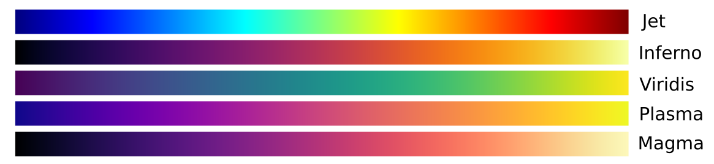

# tbip
The text-based image package (TBIP) is a simple C++ library created to create and manipulate `.ppm` image files.

# Compiling and installing
The library can be downloaded directly from GitHub using the command:

```
git clone https://github.com/ppravatto/tbip
```

Once downloaded the library can be compiled and installed using cmake. First, it is advisable to create a `build` folder within the `tbip` folder. To do so the following commands can be used:

```
cd tbip
mkdir build
cd build
```

Now that we are in the build folder we can run cmake to prepare a `Makefile`, compile the code, and install it. This can be done by running the commands:

```
cmake ..
make
sudo make intsall
```

this will install the `libtbip.so` into the `/usr/local` folder. If you desire to change the installation path you can use the option `-DCMAKE_INSTALL_PREFIX=<path>`.


# Main functions
In the following section, a simple description of the main functions of the library will be presented.

## The `RGB` structure
The `RGB` structure, contained in the `tbip` namespace, is a simple container encoding the values associated with the red `r`, green `g`, and blue `b` channels. An `RGB` object can be created using the parametrized constructor by setting the channel values according to:

```
int red = 0;
int blue = 10;
int green = 128;

tbip::RGB color(red, green, blue)
```

The `rgb` values can be accessed directly or can be set simultaneously using the `void set(int r_, int g_, int b_)` function.

The class also provides a `RGB get_graylevel()` function capable of returning the gray level associated with the specified color.

## The `Colormap` class and derived classes
The `Colormap` abstract class, contained in the `tbip::cmap` namespace, represents the base class from which all the colormap objects are derived. An instance of a daughter class, derived from `Colormap`, can be constructed by specifying the maximum number of color levels and the range of values in which the values to be mapped will fall. As an example consider the following code in which an instance of the `Viridis` class is set up to generate color shades in `1024` levels when mapping values between `-1.` and `4.`:

```
tbip::cmap::Viridis myCmap(1024, 4., -1.);
```

if the colormap must be inverted a fourth boolean argument can be provided according to:

```
tbip::cmap::Viridis myCmap(1024, 4., -1., true);
```

Once an instance of a colormap class is created, the `RGB` color values corresponding to a given value can be obtained by directly invoking the colormap using the `()` operator. As an example:

```
tbip::RGB color = myCmap(2.)
```

The following colorbars have been implemented in the current version of `tbip`:




## The `Image` class
The `Image` class, contained in the `tbip` namespace, represents the core of the library and can encode RGB images with up to 65536 levels per channel. An `Image` object contains an RGB map composed of a `width` number of pixels on the `x` axis and `height` pixels on the `y` axis. The number of colors for each channel can be set by setting the `max` color value in the class constructor.

An instance of the `Image` class can be directly created using one of the provided constructors. As an example, a 128 by 256 pixel image colored with 1024 color levels can be defined according to:

```
tbip::Image myImage(128, 256, 1024);
```

Once initialized, an image object can be manipulated using various built-in functions:

| Function | Description |
|----------|-------------|
| `void save(std::string filename)` | Save the current image using the user-specified `filename`. |
| `void set_pixel(int x, int y, RGB color)` | Set the pixel located at the coordinates `(x, y)` to the specified `color` value. |
| `void set_pixel(int x, int y, int r, int g, int b)` | Set the pixel located at the coordinates `(x, y)` to the specified `r`, `g`, and `b` color channels values. |
| `void fill(RGB color)` | Fill the whole image with the `color` value. |
| `void fill(int r, int g, int b)` | Fill the whole image with the specified `r`, `g`, and `b` color channels values. |
| `void to_grayscale()` | Convert the image to grayscale. |
| `void to_negative()` | Convert the image to negative. |


# Example

